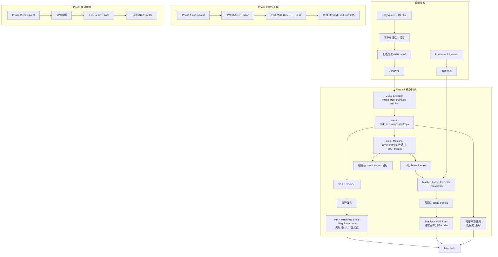
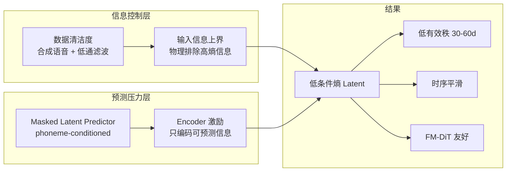

# 设计文档: Generation-Friendly Latent (Soft VQ via Information-Theoretic Pressure)

## 概述

本方案为 Wav-VAE 设计一套全新的多阶段训练流水线，目标是在不改变 V16.3 架构（256x stride, 384d latent, Oobleck-style encoder/decoder）的前提下，通过信息论约束（数据清洁度 + 掩码潜表示预测）迫使 encoder 只编码低条件熵、低秩的语义信息，从而产出对下游 FM-DiT TTS 友好的连续潜表示。

核心思路：用"Soft VQ"替代显式离散量化——通过 Masked Latent Predictor 的联合训练，encoder 被激励只编码可预测的（低条件熵）信息，自然达到类似 VQ 的低有效秩效果（目标 30-60 / 384d），同时保持连续表示的梯度友好性。

本方案吸取了 V17/V18 的教训：不使用任何显式语义监督（无 CTC、无 speaker loss、无 factor decomposition），仅依赖数据层面的信息控制和预测压力来塑造潜空间结构。

## 架构

### 系统总览



### 信息瓶颈机制



## 组件与接口

### 组件 1: Masked Latent Predictor (新增核心组件)

**用途**: 接收音素序列和可见 latent frames，预测被遮蔽的 latent frames。通过梯度回传到 encoder，迫使 encoder 编码可预测的信息。

**接口**:

```python
class MaskedLatentPredictor(nn.Module):
    """Transformer-based masked latent predictor.
    
    Input:
        z_visible: [B, T_vis, 384] - 可见的 latent frames
        visible_mask: [B, T] - bool, True = 可见
        phoneme_ids: [B, T_ph] - 音素 ID 序列
        phoneme_durations: [B, T_ph] - 每个音素的帧数
    
    Output:
        z_predicted: [B, T_masked, 384] - 预测的被遮蔽 frames
    """
    
    def __init__(
        self,
        latent_dim: int = 384,
        hidden_dim: int = 512,
        n_heads: int = 8,
        n_layers: int = 6,
        phoneme_vocab_size: int = 512,
        max_seq_len: int = 4096,
        dropout: float = 0.1,
    ): ...
    
    def forward(
        self,
        z_visible: torch.Tensor,
        visible_mask: torch.Tensor,
        phoneme_ids: torch.Tensor,
        phoneme_durations: torch.Tensor,
    ) -> torch.Tensor: ...
```

**职责**:
- 将音素序列通过 duration 展开到帧级别，作为位置条件
- 对可见 latent frames 施加位置编码
- 通过 Transformer 交叉注意力预测被遮蔽位置的 latent
- 梯度回传到 encoder（联合训练的关键）

### 组件 2: Block Masking Strategy

**用途**: 生成大块连续遮蔽，迫使 predictor 依赖全局语义（音素）而非局部插值。

**接口**:

```python
class BlockMaskGenerator:
    """生成 block mask 用于 masked latent prediction.
    
    策略: 50%+ 的 frames 被遮蔽，每个 block 长度 ~500+ frames (约 6 秒 @ 86fps)
    """
    
    def __init__(
        self,
        mask_ratio: float = 0.6,
        min_block_frames: int = 400,
        max_block_frames: int = 800,
    ): ...
    
    def generate_mask(
        self,
        seq_len: int,
        batch_size: int,
    ) -> torch.Tensor:
        """返回 [B, T] bool tensor, True = 可见, False = 被遮蔽"""
        ...
```

**职责**:
- 保证遮蔽比例 ≥ 50%
- 生成连续大块遮蔽（非随机帧级）
- 确保至少有部分可见帧供 predictor 参考

### 组件 3: Temporal Smoothing Regularizer

**用途**: 对 latent 施加时序平滑约束，配合 masked prediction 压力自然产生的平滑效果。

**接口**:

```python
class TemporalSmoothnessLoss(nn.Module):
    """帧间差分 L2 正则.
    
    L_smooth = mean(||z_t - z_{t-1}||^2)
    
    权重从极低值开始，随训练渐增。
    """
    
    def __init__(self, initial_weight: float = 1e-5, max_weight: float = 1e-3): ...
    
    def forward(self, z: torch.Tensor, step: int, total_steps: int) -> torch.Tensor: ...
```

### 组件 4: Phase-Aware Training Scheduler

**用途**: 管理三阶段训练的超参数调度。

**接口**:

```python
class PhaseScheduler:
    """三阶段训练调度器.
    
    Phase 1: 低通数据 + Mel/STFT magnitude + Masked Predictor
    Phase 2: 逐步提高频率 + 更强重建 loss
    Phase 3: 全频 + L1/L2 + 判别器
    """
    
    def __init__(self, phase_configs: list[PhaseConfig]): ...
    
    def get_current_config(self, epoch: int) -> PhaseConfig: ...
    
    def get_lpf_cutoff(self, epoch: int) -> float:
        """返回当前 epoch 的低通滤波截止频率 (Hz)"""
        ...
```

### 组件 5: Data Pipeline (CosyVoice3 合成 + 低通滤波)

**用途**: 使用 CosyVoice3 合成干净单说话人数据，并施加低通滤波。

**接口**:

```python
class SynthesizedAudioDataset(Dataset):
    """从 CosyVoice3 合成的干净语音数据集.
    
    特点:
    - 单说话人（消除说话人变异性）
    - 无噪声、无混响
    - 低通滤波（Phase 1: 4kHz cutoff）
    - 附带 phoneme alignment 信息
    """
    
    def __init__(
        self,
        data_jsonl: str,
        sr: int = 22050,
        segment_length: int = 65536,
        lpf_cutoff_hz: float = 4000.0,
        total_stride: int = 256,
    ): ...
    
    def __getitem__(self, idx) -> dict:
        """返回:
        {
            'audio': [1, T] - 低通滤波后的波形
            'phoneme_ids': [T_ph] - 音素 ID 序列
            'phoneme_durations': [T_ph] - 帧级 duration
        }
        """
        ...
```

## 数据模型

### 训练数据格式

```python
# CosyVoice3 合成数据 JSONL 格式
@dataclass
class SynthesisRecord:
    audio_path: str           # 合成音频路径
    text: str                 # 原始文本
    phonemes: list[str]       # 音素序列
    durations: list[int]      # 每个音素的采样点数
    speaker_id: str           # 说话人 ID (Phase 1 固定单人)
    sample_rate: int          # 22050
    
# Phoneme vocabulary
# 复用 CosyVoice3 的音素集 (~200 个中文音素 + 特殊符号)
```

### 训练配置数据模型

```python
@dataclass
class PhaseConfig:
    """单阶段训练配置"""
    phase_id: int                    # 1, 2, 3
    epochs: int                      # 该阶段训练轮数
    lpf_cutoff_hz: float | None      # 低通截止频率, None = 不滤波
    
    # Loss 权重
    mel_weight: float                # Mel loss 权重
    stft_mag_weight: float           # Multi-res STFT magnitude loss 权重
    l1_time_weight: float            # 时域 L1 (Phase 1/2 = 0)
    predictor_weight: float          # Masked predictor loss 权重
    smooth_weight: float             # 时序平滑权重
    
    # 判别器
    adv_enable: bool                 # Phase 1/2 = False
    
    # Masked predictor
    mask_ratio: float                # 遮蔽比例
    min_block_frames: int            # 最小 block 长度
    
    # 学习率
    encoder_lr: float
    decoder_lr: float
    predictor_lr: float


@dataclass
class TrainingState:
    """训练状态追踪"""
    current_phase: int
    current_epoch: int
    global_step: int
    best_predictor_loss: float
    best_mel_loss: float
    effective_rank: float | None     # 定期评估
```

### 评估指标数据模型

```python
@dataclass
class EvalMetrics:
    """评估指标"""
    # 重建质量
    mel_loss: float
    stft_mag_loss: float
    snr_db: float | None             # Phase 3 才有意义
    
    # Latent 结构
    effective_rank_95: float         # 目标: 30-60 (vs V16.3 的 234)
    effective_rank_99: float
    
    # 预测性
    predictor_loss_with_phoneme: float    # 有音素条件时的预测 loss
    predictor_loss_without_phoneme: float # 无音素条件时的预测 loss
    phoneme_utility: float               # 差值, 越大说明音素越有用
    
    # 时序平滑度
    frame_diff_l2: float                 # mean(||z_t - z_{t-1}||^2)
    
    # 下游兼容性 (后期)
    flow_subspace_probe_loss: float | None  # V17.4-style probe
```

## 序列图: Phase 1 训练循环

```mermaid
sequenceDiagram
    participant DL as DataLoader
    participant ENC as V16.3 Encoder
    participant DEC as V16.3 Decoder
    participant MASK as Block Masker
    participant PRED as Masked Predictor
    participant OPT as Optimizer

    DL->>ENC: audio_lpf [B, 1, T]
    DL->>PRED: phoneme_ids, durations
    
    ENC->>ENC: z = encode(audio_lpf) → [B, 384, T/256]
    
    Note over ENC,DEC: 重建路径
    ENC->>DEC: z
    DEC->>DEC: recon = decode(z)
    DEC->>OPT: L_recon = Mel + STFT_mag (无 L1, 无 phase)
    
    Note over ENC,PRED: 预测路径
    ENC->>MASK: z
    MASK->>MASK: mask = block_mask(T/256, ratio=0.6)
    MASK->>PRED: z_visible = z[:, :, mask]
    PRED->>PRED: z_pred = predict(z_visible, phonemes)
    PRED->>OPT: L_pred = MSE(z_pred, z[:, :, ~mask].detach()
    
    Note over ENC,OPT: 注意: L_pred 梯度流经 Predictor 到 Encoder
    Note over ENC,OPT: z target 对 encoder 不 detach (联合训练)
    
    ENC->>OPT: L_smooth = temporal_smoothness(z)
    
    OPT->>OPT: L_total = L_recon + λ_pred * L_pred + λ_smooth * L_smooth
    OPT->>ENC: update encoder params
    OPT->>DEC: update decoder params
    OPT->>PRED: update predictor params
```

## 序列图: Masked Predictor 内部流程

```mermaid
sequenceDiagram
    participant IN as Input
    participant PHE as Phoneme Encoder
    participant DUR as Duration Expand
    participant POS as Positional Encoding
    participant TF as Transformer Layers
    participant OUT as Output Projection

    IN->>PHE: phoneme_ids [B, T_ph]
    PHE->>PHE: phoneme_emb [B, T_ph, D]
    PHE->>DUR: phoneme_emb + durations
    DUR->>DUR: expand to frame-level [B, T, D]
    
    IN->>POS: z_visible [B, T_vis, 384]
    POS->>POS: add positional encoding
    
    Note over DUR,TF: 拼接: [phoneme_frames; visible_latent_frames]
    DUR->>TF: phoneme context [B, T, D]
    POS->>TF: visible latent [B, T_vis, 384]
    
    TF->>TF: Self-attention over visible + cross-attention to phoneme
    TF->>TF: × N layers
    
    TF->>OUT: hidden states at masked positions
    OUT->>OUT: Linear(D, 384) → z_predicted [B, T_masked, 384]
```

## 错误处理

### 场景 1: Predictor Collapse (预测器坍缩)

**条件**: Predictor loss 降到极低但 latent 有效秩也极低（< 10）
**响应**: 这表明 encoder 找到了退化解——编码常数或极低维信息让 predictor 轻松预测
**恢复**: 
- 增强重建 loss 权重，确保 decoder 需要丰富信息
- 监控 mel reconstruction quality 作为下界保护
- 如果 mel loss 恶化超过阈值，降低 predictor_weight

### 场景 2: JEPA-style Representation Collapse

**条件**: Latent 方差趋近于零，所有帧编码相似向量
**响应**: 重建 loss 应自然防止此问题（decoder 需要不同帧信息来重建不同音频段）
**恢复**:
- 确认重建 loss 梯度正常流动
- 如果仍然发生，添加 latent variance lower bound 约束
- 降低 predictor_weight

### 场景 3: Phase 2 频率扩展导致 Latent 结构崩溃

**条件**: 提高 LPF cutoff 后，effective rank 突然跳升到 V16.3 水平
**响应**: 新高频信息涌入，encoder 试图编码所有细节
**恢复**:
- 放慢 cutoff 提升速度
- 增强 predictor_weight 和 smooth_weight
- 确保 predictor 仍然有效约束 latent

### 场景 4: Predictor 与 Encoder 梯度冲突

**条件**: 训练不稳定，loss 震荡
**响应**: Predictor 梯度和 reconstruction 梯度方向冲突
**恢复**:
- 降低 predictor_weight
- 对 encoder 使用更小的学习率
- 考虑 predictor warmup（先冻结 encoder 训练 predictor 几百步）

## Correctness Properties

*A property is a characteristic or behavior that should hold true across all valid executions of a system—essentially, a formal statement about what the system should do. Properties serve as the bridge between human-readable specifications and machine-verifiable correctness guarantees.*

### Property 1: Low-pass filter energy attenuation

*For any* audio signal and any cutoff frequency f_c, after applying the low-pass filter, the energy in frequency bands above f_c SHALL be attenuated below a threshold (e.g., -40dB relative to unfiltered).

**Validates: Requirements 1.2, 1.3**

### Property 2: Data pipeline output completeness

*For any* valid data record in the dataset, the Data_Pipeline SHALL return a dictionary containing 'audio' (tensor), 'phoneme_ids' (tensor), and 'phoneme_durations' (tensor), where sum(phoneme_durations) equals the number of latent frames (audio_length / stride).

**Validates: Requirements 1.1, 1.5**

### Property 3: Predictor output shape consistency

*For any* valid input combination (z_visible, visible_mask, phoneme_ids, phoneme_durations), the Masked_Latent_Predictor output shape SHALL be [B, count(~visible_mask), 384], and the phoneme duration expansion SHALL produce a frame-level sequence of length equal to sum(phoneme_durations).

**Validates: Requirements 2.1, 2.2, 2.3**

### Property 4: Gradient flow from predictor to encoder

*For any* valid input, after computing the predictor MSE loss and calling backward(), the Encoder parameters SHALL have non-None and non-zero gradients.

**Validates: Requirements 2.4, 2.5**

### Property 5: Block masker invariants

*For any* sequence length T >= min_block_frames and batch size B, the Block_Masker SHALL produce a boolean tensor of shape [B, T] where: (a) the fraction of masked (False) positions is >= 0.5, and (b) at least one position per sequence is visible (True).

**Validates: Requirements 3.1, 3.3, 3.4**

### Property 6: Block length bounds

*For any* generated mask, every contiguous run of masked (False) positions SHALL have length within [min_block_frames, max_block_frames].

**Validates: Requirement 3.2**

### Property 7: Temporal smoothness loss correctness

*For any* latent tensor z of shape [B, D, T], the Temporal_Smoothness_Loss SHALL return a non-negative scalar equal to mean(||z[:,:,t] - z[:,:,t-1]||²), and for any constant sequence (all frames identical), the loss SHALL be exactly zero.

**Validates: Requirements 4.1, 4.2, 4.4**

### Property 8: Smoothness weight linear scheduling

*For any* training step s in [0, total_steps], the smoothness weight SHALL equal initial_weight + (max_weight - initial_weight) * s / total_steps, monotonically increasing from initial_weight to max_weight.

**Validates: Requirement 4.3**

### Property 9: Phase scheduler config invariants

*For any* epoch in the valid training range, the Phase_Scheduler SHALL return a complete PhaseConfig where: Phase 1 epochs have adv_enable=False and l1_time_weight=0; Phase 3 epochs have adv_enable=True and l1_time_weight > 0.

**Validates: Requirements 5.1, 5.2, 5.4**

### Property 10: Phase 2 monotonic frequency increase

*For any* two epochs e1 < e2 both within Phase 2, the LPF cutoff frequency at e2 SHALL be >= the cutoff at e1, and the STFT loss weight at e2 SHALL be >= the weight at e1.

**Validates: Requirement 5.3**

### Property 11: Encoder output shape

*For any* input audio of length T (where T is a multiple of 256), the Encoder SHALL produce output of shape [B, 384, T/256].

**Validates: Requirement 6.1**

### Property 12: Collapse detection logic

*For any* pair (effective_rank, predictor_loss) where effective_rank < 10 and predictor_loss < collapse_threshold, the training system SHALL flag predictor collapse and reduce predictor_weight.

**Validates: Requirement 7.1**

### Property 13: Effective rank computation

*For any* matrix with known singular value distribution, the computed effective rank (95% variance explained) SHALL match the analytical expected value. For a rank-k matrix (exactly k non-zero singular values), effective_rank_95 SHALL equal k.

**Validates: Requirement 8.1**

### Property 14: Checkpoint save/load round-trip

*For any* training state (model weights, optimizer state, phase, epoch, global_step), saving to a checkpoint file and then loading from that file SHALL produce an equivalent training state.

**Validates: Requirements 9.3, 9.4**

## 测试策略

### 单元测试

- MaskedLatentPredictor: 验证输入输出维度、mask 处理正确性
- BlockMaskGenerator: 验证 mask ratio 在目标范围内、block 长度符合约束
- TemporalSmoothnessLoss: 验证常数序列 loss=0、随机序列 loss>0
- PhaseScheduler: 验证阶段切换逻辑、LPF cutoff 调度

### 属性测试 (Property-Based Testing)

**测试库**: hypothesis (Python)

- BlockMaskGenerator: 对任意 seq_len 和 batch_size，mask ratio 始终在 [min_ratio, max_ratio] 范围内
- TemporalSmoothnessLoss: 对任意输入，loss ≥ 0；对常数输入，loss = 0
- Predictor 输出维度: 对任意 mask pattern，输出 shape 与 masked positions 数量一致

### 集成测试

- Smoke test: 完整 Phase 1 训练循环 1 个 epoch，验证 loss 下降
- Predictor 梯度流: 验证 L_pred 梯度确实流到 encoder 参数
- 评估流水线: 验证 effective rank 计算、predictor utility 计算正确

## 性能考虑

### 内存

- V16.3 模型 ~43M 参数 + Masked Predictor ~20M 参数
- Gradient checkpointing 已启用（use_checkpoint=true）
- RTX 5090 32GB 应足够 batch_size=1 + grad_accum=16 + segment_length=65536
- Predictor 的 Transformer 可能需要限制 max_seq_len（65536/256 = 256 frames per segment）

### 计算

- Phase 1 主要开销: encoder forward + decoder forward + predictor forward + 3 个 backward
- Predictor 的 Transformer 在 256 frames 序列长度下计算量可控
- 低通滤波在数据加载时离线完成，不增加训练时计算

### 数据

- CosyVoice3 合成数据需要预先生成（离线）
- 估计需要 ~10-50 小时单说话人数据（文本多样性优先）
- 低通滤波可在数据集 __getitem__ 中实时计算（torchaudio resample 或 scipy butter filter）

## 安全考虑

- 训练数据为合成语音，无隐私风险
- 模型 checkpoint 不含敏感信息
- 远程服务器访问通过 SSH 密钥认证

## 依赖

### 现有依赖（已在项目中）
- PyTorch >= 2.0
- torchaudio
- Hydra (OmegaConf)
- soundfile
- numpy

### 新增依赖
- scipy（低通滤波 butter filter）— 可能已安装
- CosyVoice3 推理环境（数据合成阶段，独立于训练）

### 外部资源
- V16.3 预训练 checkpoint: `outputs/models/wav_vae_v16.3_256x_dim384_time_remote_main/best.pt`
- CosyVoice3 模型: `/root/autodl-tmp/project/CosyVoice_main/`
- 合成数据脚本: `scripts/build_cosyvoice3_cross_speaker_dataset.py`（需适配为单说话人版本）
